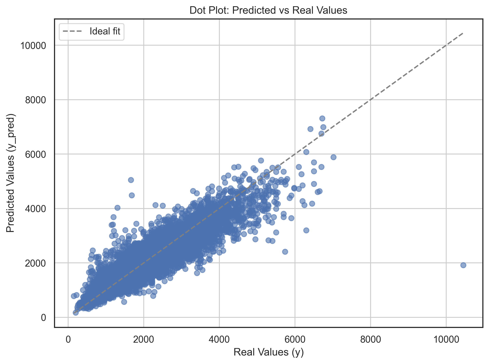

# apartment-rent-price-prediction-around-Bulach

A Streamlit app to predict real estate apartment excl. rent prices for switzerland.

You can use the app via the Streamlit link:

[Streamlit App Link](https://apartment-rent-price-prediction-switzerland-omdkidunyhc3ssby75.streamlit.app/)  <!-- Add your Streamlit app URL here -->

Feel free to play around, share, give feedback, and use!

## Project Description

This project uses machine learning to predict apartment rental prices in Switzerland based on various features such as size, number of rooms, amenities, and more. The model retrieves data via an API and provides users with an estimated rent price, confidence interval, and a graphical representation of the prediction.

## Model Summary
The model with `alpha = 0.5` was trained using a `LGBMRegressor` with hyperparameters optimized via [Optuna](https://optuna.org/).

The evaluation metrics are as follows:

- **Number of training/validation datapoints:** 718'096  
- **Number of out-of-sample datapoints:** 79'789  
- **MAE (out-of-sample):** 147.29
- **RMSE (out-of-sample):** 218.32  
- **R² (out-of-sample):** 0.868



For more information please contact me at https://www.immolex.ch

## Usage
### for use with steamlit
Access the App on Steamlit: https://apartment-rent-price-prediction-switzerland-omdkidunyhc3ssby75.streamlit.app/

### for local run (with API)
#### Requirements

- Python 3.x
- Streamlit
- Dependencies listed in the `requirements.txt` file.

#### Clone the repository:
```
git clone https://github.com/wonich/apartment-rent-price-prediction-switzerland.git

Navigate to the project directory:

cd apartment-rent-price-prediction-switzerland
```
#### Install the dependencies:
Ensure pip is installed, then run:

```bash
pip install -r requirements.txt

Install Streamlit (if not already installed):

pip install streamlit
```
API Key:
To make predictions via the API, you need an API key from Immolex.ch. Store the API key in a .env file:

API_KEY=your_api_key_here

#### Configuration

To configure the model and API correctly, follow these steps:

API Key:

Obtain an API key from Immolex.ch and store it in a .env file in the root directory of the project:

API_KEY=your_api_key_here

Data Source:

The project uses the Immolex.ch API. Ensure you're using the correct API endpoints and parameters.

#### Run steamlit localy
First go to step 2 and 3 then continue here

Run the Streamlit app:

```streamlit run app.py```

Enter the apartment details:

Select values for parameters like number of rooms, square meters, etc.

Click the "Predict Rent Price" button to calculate the rent price prediction.


View the results:

The predicted rent price will be shown, along with the confidence interval and a graphical representation of the prediction.


## License

Feel free to play around, share, give feedback, and use!

See license in git-repo


## Troubleshooting

Error: "ModuleNotFoundError": Ensure all Wdependencies are installed:

```pip install -r requirements.txt```

Error with API Key: Double-check that the API key is correctly set in the .env file.

## Acknowledgments

Streamlit: Thanks to Streamlit for providing an easy-to-use platform for building interactive apps.
    
IMMOLEX: The data is powered by IMMOLEX www.immolex.ch